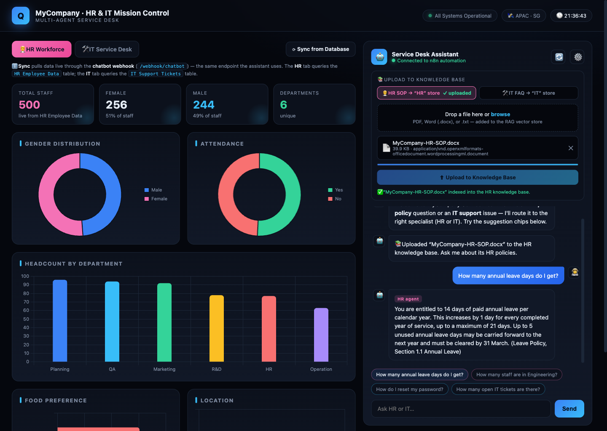

<div align="center">

# 🛰️ MyCompany · HR & IT Mission Control

[](https://alfredang.github.io/missioncontrol/)
[](#)
[](https://www.chartjs.org/)
[](https://n8n.io/)
[](https://www.python.org/)
[](#-license)

**A single-page mission-control dashboard for a multi-agent HR & IT service desk — live workforce/ticket analytics, a RAG knowledge base, and a routing chat assistant, all wired to an n8n backend.**

[Live Demo](https://alfredang.github.io/missioncontrol/) · [Report Bug](https://github.com/alfredang/missioncontrol/issues) · [Request Feature](https://github.com/alfredang/missioncontrol/issues)

</div>

---

## 📸 Screenshot



> The HR Workforce tab synced live from the database, the HR SOP indexed into the RAG knowledge base, and the assistant answering a policy question with a cited source.

---

## 📖 About

**Mission Control** is the front-end for an **n8n multi-agent service desk** (the `Activity5-MultiAgents` workflow). A single `index.html` file delivers three things at once:

- 📊 **Live dashboards** for HR workforce and IT service-desk metrics, rendered with Chart.js and synced on demand from n8n Data Tables.
- 📚 **A RAG knowledge-base uploader** — drop an HR SOP or IT FAQ document and it is embedded into the matching vector store so the assistant can answer policy & how-to questions.
- 🤖 **A routing chat assistant** that sends each question through a single chatbot webhook, where a Switch routes it to the right specialist agent (HR or IT).

Everything is driven through n8n webhooks — no build step, no framework, no server of its own.

### ✨ Key Features

| Feature | Description |
|---------|-------------|
| 🧑‍💼 **HR Workforce dashboard** | Total staff, gender split, departments, attendance, food preference & location — live from the `HR Employee Data` table |
| 🛠️ **IT Service Desk dashboard** | Tickets by status, priority, category & department — live from the `IT Support Tickets` table |
| ⟳ **Sync from Database** | Pulls fresh stats through the same `/webhook/chatbot` endpoint the assistant uses |
| 📚 **Knowledge-base upload** | Drag-and-drop PDF / DOCX / TXT into the **HR** or **IT** vector store for RAG |
| 🤖 **Routing assistant** | One chat box; an n8n Switch routes each message to the HR or IT agent |
| 🔌 **Configurable webhooks** | Webhook URLs are editable in-UI and persisted to `localStorage` |
| 🪄 **Zero build** | Pure HTML/CSS/JS via CDN — open the file or host it statically |

---

## 🧰 Tech Stack

| Category | Technologies |
|----------|-------------|
| **Frontend** | Vanilla HTML5, CSS3, JavaScript (ES modules-free) |
| **Charts** | [Chart.js 4](https://www.chartjs.org/) via CDN |
| **Automation / Backend** | [n8n](https://n8n.io/) multi-agent workflow (`missioncontrol.json`) |
| **AI / LLM** | OpenAI Chat Model + OpenAI Embeddings (in n8n), Tavily web search |
| **RAG** | n8n Vector Store + Default Data Loader |
| **Data** | n8n Data Tables (`HR Employee Data`, `IT Support Tickets`) |
| **Mock data** | Python 3 generators (`make_mock_data.py`, `make_it_faq.py`) |
| **Hosting** | GitHub Pages (static) via GitHub Actions |

---

## 🏗️ Architecture

```
┌──────────────────────────────────────────────────────────────┐
│                  index.html  (Mission Control UI)            │
│                                                              │
│  ┌────────────┐   ┌────────────┐   ┌──────────────────────┐  │
│  │ HR / IT    │   │  KB Upload │   │  Routing Chat        │  │
│  │ Dashboards │   │  Dropzone  │   │  Assistant           │  │
│  └─────┬──────┘   └─────┬──────┘   └──────────┬───────────┘  │
└────────┼────────────────┼─────────────────────┼─────────────┘
         │ /webhook/        │ /webhook/upload-hr  │ /webhook/chatbot
         │  chatbot (sync)  │ /webhook/upload-it  │
         ▼                  ▼                     ▼
┌──────────────────────────────────────────────────────────────┐
│                  n8n · Activity5-MultiAgents                  │
│                                                              │
│        ┌───────────────── Switch (router) ─────────────┐     │
│        ▼                                               ▼     │
│   ┌─────────┐                                    ┌─────────┐ │
│   │ HR Agent│                                    │ IT Agent│ │
│   └────┬────┘                                    └────┬────┘ │
│        │ tools                                        │ tools│
│  ┌─────┴───────────────┐                  ┌───────────┴────┐ │
│  │ • Knowledge Base     │                 │ • Knowledge Base│ │
│  │   (HR SOP vectors)   │                 │   (IT FAQ vec.) │ │
│  │ • HR Employee Data   │                 │ • IT Tickets    │ │
│  │ • Tavily web search  │                 │ • Tavily search │ │
│  └──────────────────────┘                 └─────────────────┘ │
└──────────────────────────────────────────────────────────────┘
```

---

## 📁 Project Structure

```
missioncontrol/
├── index.html                    # The entire dashboard (UI + logic + styles)
├── missioncontrol.json           # n8n workflow export (Activity5-MultiAgents)
├── make_mock_data.py             # Generates mock HR + IT table CSVs
├── make_it_faq.py                # Generates the IT FAQ knowledge-base document
├── mock-hr-employees.csv         # Mock data → "HR Employee Data" table
├── mock-it-tickets.csv           # Mock data → "IT Support Tickets" table
├── MyCompany-HR-SOP.docx         # Sample HR SOP for the RAG knowledge base
├── MyCompany-IT-Support-FAQ.docx # Sample IT FAQ for the RAG knowledge base
├── docs/
│   └── screenshot.png            # Hero screenshot
└── .github/workflows/
    └── deploy.yml                # GitHub Pages deployment
```

---

## 🚀 Getting Started

### Prerequisites

- A modern web browser (the dashboard is a single static file)
- *(Optional)* [n8n](https://n8n.io/) to run the backend automation
- *(Optional)* Python 3.10+ to regenerate the mock data

### Run the dashboard locally

```bash
# Clone
git clone https://github.com/alfredang/missioncontrol.git
cd missioncontrol

# Serve statically (any static server works)
python3 -m http.server 8099
# then open http://localhost:8099/index.html
```

### Connect the backend

1. Import `missioncontrol.json` into your n8n instance.
2. Create two Data Tables — **HR Employee Data** and **IT Support Tickets** — and import the CSVs from `make_mock_data.py`.
3. Activate the workflow and copy your webhook base URL.
4. In the dashboard, click the **⚙️** gear (and the KB upload settings) to point the chatbot / upload webhooks at your n8n instance. They are stored in `localStorage`.
5. Click **⟳ Sync from Database** to load live stats, then drop an SOP/FAQ file to index the knowledge base.

### Regenerate mock data (optional)

```bash
python3 make_mock_data.py   # → mock-hr-employees.csv, mock-it-tickets.csv
python3 make_it_faq.py      # → MyCompany-IT-Support-FAQ.docx
```

---

## 🌐 Deployment

This repo deploys automatically to **GitHub Pages** via GitHub Actions (`.github/workflows/deploy.yml`) on every push to `main`. The live site is served at:

**https://alfredang.github.io/missioncontrol/**

To host elsewhere, just serve `index.html` from any static host (Netlify, Vercel, S3, Nginx). No build step is required.

---

## 🤝 Contributing

Contributions are welcome!

1. Fork the repository
2. Create a feature branch (`git checkout -b feature/amazing-feature`)
3. Commit your changes (`git commit -m 'Add amazing feature'`)
4. Push to the branch (`git push origin feature/amazing-feature`)
5. Open a Pull Request

Have an idea or question? Open an [issue](https://github.com/alfredang/missioncontrol/issues).

---

## 📜 License

Released under the MIT License.

---

## 👨‍💻 Developed By

**Tertiary Infotech Pte. Ltd.** — training & solutions for AI automation.

## 🙏 Acknowledgements

- [n8n](https://n8n.io/) — workflow automation & multi-agent orchestration
- [Chart.js](https://www.chartjs.org/) — dashboard visualisations
- [OpenAI](https://openai.com/) & [Tavily](https://tavily.com/) — LLM, embeddings & web search

---

<div align="center">

⭐ **If this project helped you, give it a star!** ⭐

</div>
